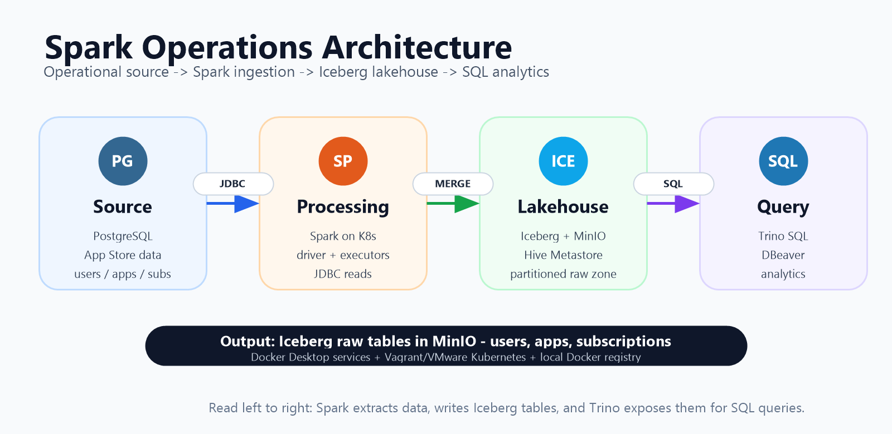
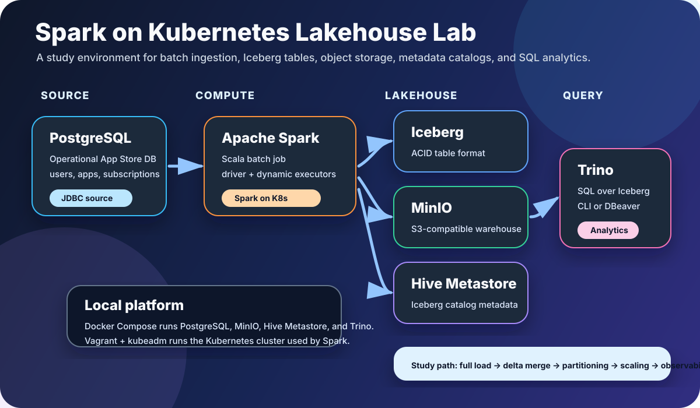
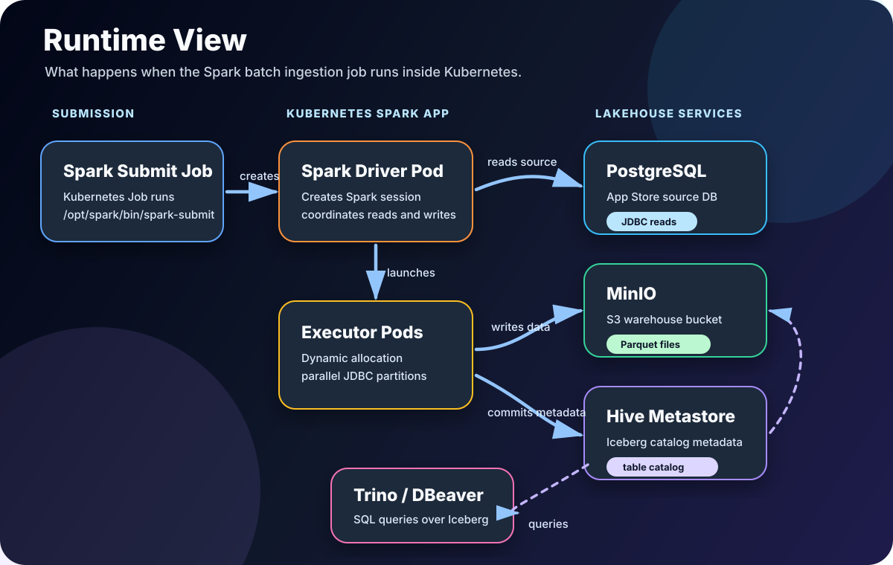

# spark-lakehouse-lab

[](https://spark.apache.org/)
[](https://apache.github.io/spark/)
[](https://www.scala-lang.org/)
[](https://adoptium.net/temurin/releases/?version=17)
[](https://iceberg.apache.org/)
[](https://kubernetes.io/)
[](https://docs.docker.com/compose/)
[](https://www.postgresql.org/)
[](https://min.io/)
[](https://hive.apache.org/)
[](https://trino.io/)
[](https://developer.hashicorp.com/vagrant)

This project is a local production-style data engineering lab.

It simulates an operational PostgreSQL source, runs Spark batch ingestion on Kubernetes, writes Iceberg tables to MinIO, stores catalog metadata in Hive Metastore, and queries the lakehouse with Trino.

## Architecture Design

<p align="center">
  
</p>

## Technology Stack

<p align="center">
  
</p>

Use this repository as a study lab for Spark on Kubernetes in a data lakehouse. The goal is not only to run one job, but to understand how production-style components connect:

- PostgreSQL behaves like an operational source system.
- Spark on Kubernetes behaves like the distributed processing runtime.
- Iceberg, MinIO, and Hive Metastore behave like the lakehouse storage and catalog layer.
- Trino and DBeaver behave like downstream analytics consumers.

This architecture has four main layers:

| Layer | Components | Responsibility |
| --- | --- | --- |
| Operational Source | PostgreSQL App Store database | Simulates production transactional data. |
| Processing Runtime | Spark on Kubernetes | Reads source data with JDBC and writes Iceberg tables. |
| Lakehouse Storage | MinIO, Iceberg, Hive Metastore | Stores data files, table metadata, and catalog definitions. |
| Query Layer | Trino, DBeaver, Trino CLI | Provides SQL access to the raw Iceberg tables. |

### Data Movement

```text
PostgreSQL App Store DB
        |
        | JDBC partitioned reads
        v
Spark Driver + Dynamic Executors on Kubernetes
        |
        | Iceberg write / MERGE INTO
        v
MinIO warehouse bucket
        |
        | Iceberg table metadata registered in Hive Metastore
        v
Trino SQL engine
        |
        | JDBC / SQL
        v
DBeaver or Trino CLI
```

### Runtime View

<p align="center">
  
</p>

Runtime sequence:

1. A Kubernetes submit job runs `spark-submit`.
2. Spark creates the driver pod.
3. The driver creates executor pods with dynamic allocation.
4. Driver and executors read PostgreSQL through partitioned JDBC reads.
5. Spark writes Iceberg data files to MinIO.
6. Spark commits Iceberg metadata through Hive Metastore.
7. Trino reads Hive Metastore metadata and MinIO data to query the tables.

## How To Use This Repo Step By Step

Follow this path after reading the architecture design. It moves from environment setup to a real Spark-on-Kubernetes ingestion run.

### 1. Start From The Repository Root

```powershell
cd C:\repository\spark-datalakeuhouse
```

All root-level Docker Compose commands in this README assume this directory.

### 2. Start The Operational Source

```powershell
docker compose -f docker-compose.postgres.yml up -d --build
```

This starts the App Store PostgreSQL database and seeds operational tables such as `users`, `apps`, and `subscriptions`.

### 3. Start The Lakehouse Services

```powershell
docker compose -f docker-compose.lakehouse.yml up -d --build
```

This starts MinIO, Hive Metastore, the metastore PostgreSQL database, and Trino.

Useful URLs:

```text
MinIO console: http://localhost:9001
Trino UI:      http://localhost:8080
```

MinIO login:

```text
minioadmin / minioadmin
```

### 4. Start Or Verify Kubernetes

```powershell
cd C:\repository\spark-datalakeuhouse\vagrant-kubeadm-kubernetes
vagrant status
vagrant up
vagrant ssh controlplane -c "kubectl get nodes"
```

Expected nodes:

```text
controlplane
node01
node02
```

Expected result: all nodes are `Ready`.

### 4.1 Access Kubernetes UI

The Kubernetes Dashboard is installed inside the Vagrant cluster. Because it is a `ClusterIP` service, your Windows browser cannot open it directly. Use `kubectl proxy` inside the control-plane VM and an SSH tunnel from Windows.

From PowerShell:

```powershell
cd C:\repository\spark-datalakeuhouse\vagrant-kubeadm-kubernetes
vagrant ssh controlplane -c "kubectl get pods -n kubernetes-dashboard"
vagrant ssh controlplane -c "kubectl proxy --address=127.0.0.1 --port=8001" -- -L 8001:127.0.0.1:8001
```

Keep that terminal open, then open this URL in your browser:

```text
http://localhost:8001/api/v1/namespaces/kubernetes-dashboard/services/https:kubernetes-dashboard:/proxy/
```

Use the login token generated by Vagrant:

```text
C:\repository\spark-datalakeuhouse\vagrant-kubeadm-kubernetes\configs\token
```

Use the Dashboard to inspect:

- Nodes after the cluster is created.
- `spark-jobs` namespace after Spark manifests are applied.
- Spark submit job pod, driver pod, and executor pods.
- Events when pods fail, for example `ImagePullBackOff`.

More details: `docs/kubernetes-dashboard-access.md`.

### 5. Build The Spark Batch Image

```powershell
cd C:\repository\spark-datalakeuhouse\spark-job-batch
docker build -t spark-job-batch:0.1.3 .
```

You do not need local SBT for this step because the Dockerfile builds the Scala application inside Docker.

### 6. Push The Spark Image To The Local Registry

Start the registry only if it is not already running:

```powershell
docker ps --filter name=registry
docker run -d -p 5000:5000 --restart always --name registry registry:2
```

If the registry container already exists, the `docker run` command can fail with a name conflict. That is OK; continue with the tag and push commands.

Then tag and push the Spark image:

```powershell
docker tag spark-job-batch:0.1.3 localhost:5000/spark-job-batch:0.1.3
docker push localhost:5000/spark-job-batch:0.1.3
```

The Kubernetes Spark submit manifest pulls this image through the host IP:

```text
192.168.31.1:5000/spark-job-batch:0.1.3
```

If your Vagrant/VMware host adapter uses a different IP, update the files listed in `Local Networking Notes`.

If Kubernetes shows `ErrImagePull` or `ImagePullBackOff` with this message:

```text
http: server gave HTTP response to HTTPS client
```

CRI-O is trying to pull the local registry with HTTPS, but the local Docker registry runs with HTTP. Configure the registry as insecure on every Kubernetes node:

```powershell
cd C:\repository\spark-datalakeuhouse\vagrant-kubeadm-kubernetes

vagrant ssh controlplane -c "sudo bash /vagrant/scripts/configure-local-registry.sh 192.168.31.1:5000"
vagrant ssh node01 -c "sudo bash /vagrant/scripts/configure-local-registry.sh 192.168.31.1:5000"
vagrant ssh node02 -c "sudo bash /vagrant/scripts/configure-local-registry.sh 192.168.31.1:5000"
```

Then delete the failed submit job and apply the manifest again:

```powershell
vagrant ssh controlplane -c "kubectl -n spark-jobs delete job spark-submit-app-store-raw-ingestion --ignore-not-found"
Get-Content -Raw -LiteralPath ..\spark-job-batch\k8s\spark-submit-app-store-raw-ingestion.yaml | vagrant ssh controlplane -c "kubectl apply -f -"
```

### 7. Run The Spark Job On Kubernetes

```powershell
cd C:\repository\spark-datalakeuhouse\vagrant-kubeadm-kubernetes
Get-Content -Raw -LiteralPath ..\spark-job-batch\k8s\spark-service-account.yaml | vagrant ssh controlplane -c "kubectl apply -f -"
Get-Content -Raw -LiteralPath ..\spark-job-batch\k8s\external-docker-services.example.yaml | vagrant ssh controlplane -c "kubectl apply -f -"
vagrant ssh controlplane -c "kubectl -n spark-jobs delete job spark-submit-app-store-raw-ingestion --ignore-not-found"
vagrant ssh controlplane -c "kubectl -n spark-jobs delete pod -l spark-app-name=app-store-raw-ingestion --ignore-not-found"
Get-Content -Raw -LiteralPath ..\spark-job-batch\k8s\spark-submit-app-store-raw-ingestion.yaml | vagrant ssh controlplane -c "kubectl apply -f -"
```

What these commands do:

1. Apply the Spark service account and RBAC permissions.
2. Create Kubernetes services that point to Docker Desktop services on the Windows host.
3. Delete the previous submit job and old Spark pods if they exist.
4. Apply the Spark submit Kubernetes `Job` manifest.
5. Let `spark-submit` create the Spark driver pod and executor pods.

### 8. Watch The Spark Application

```powershell
cd C:\repository\spark-datalakeuhouse\vagrant-kubeadm-kubernetes
vagrant ssh controlplane -c "kubectl -n spark-jobs get pods -w"
```

Expected pods:

```text
spark-submit-app-store-raw-ingestion
app-store-raw-ingestion-...-driver
app-store-raw-ingestion-...-exec-...
```

Read driver logs:

```powershell
vagrant ssh controlplane -c "kubectl -n spark-jobs logs -l spark-role=driver --tail=200"
```

Read submit job logs:

```powershell
vagrant ssh controlplane -c "kubectl -n spark-jobs logs job/spark-submit-app-store-raw-ingestion"
```

Describe a failed pod:

```powershell
vagrant ssh controlplane -c "kubectl -n spark-jobs describe pod <pod-name>"
```

List Spark namespace resources:

```powershell
vagrant ssh controlplane -c "kubectl -n spark-jobs get pods,svc,cm"
```

### 8.1 Access Spark Job UI

Spark exposes a web UI from the Spark driver pod, usually on port `4040`. This UI is only available while the Spark driver pod is running. For short batch jobs, open it quickly while the job is still active.

First find the driver pod:

```powershell
cd C:\repository\spark-datalakeuhouse\vagrant-kubeadm-kubernetes
vagrant ssh controlplane -c "kubectl -n spark-jobs get pods -l spark-role=driver"
```

Copy the driver pod name, then port-forward it through the control-plane VM:

```powershell
vagrant ssh controlplane -c "kubectl -n spark-jobs port-forward pod/<driver-pod-name> 4040:4040 --address=127.0.0.1" -- -L 4040:127.0.0.1:4040
```

Keep that terminal open, then open:

```text
http://localhost:4040
```

Use the Spark UI to study:

- Jobs, stages, and tasks.
- JDBC read parallelism.
- Executor count and task distribution.
- SQL tab for Iceberg writes and `MERGE INTO`.
- Failed stages and exception stack traces.

Important: this repository does not currently run a Spark History Server. After the driver pod finishes, the live Spark UI disappears.

### 9. Verify The Iceberg Tables With Trino

```powershell
docker exec -it lakehouse-trino trino
```

Run:

```sql
SHOW TABLES FROM iceberg.raw_app_store;

SELECT count(*) FROM iceberg.raw_app_store.users;
SELECT count(*) FROM iceberg.raw_app_store.apps;
SELECT count(*) FROM iceberg.raw_app_store.subscriptions;
```

### 10. Inspect Storage In MinIO

Open:

```text
http://localhost:9001
```

Look in the `warehouse` bucket. Expected Iceberg data folders:

```text
raw_app_store.db/users/
raw_app_store.db/apps/
raw_app_store.db/subscriptions/
```

### 11. Re-run As A Study Exercise

Run the same command again:

```powershell
cd C:\repository\spark-datalakeuhouse\vagrant-kubeadm-kubernetes
vagrant ssh controlplane -c "kubectl -n spark-jobs delete job spark-submit-app-store-raw-ingestion --ignore-not-found"
vagrant ssh controlplane -c "kubectl -n spark-jobs delete pod -l spark-app-name=app-store-raw-ingestion --ignore-not-found"
Get-Content -Raw -LiteralPath ..\spark-job-batch\k8s\spark-submit-app-store-raw-ingestion.yaml | vagrant ssh controlplane -c "kubectl apply -f -"
```

The default mode is `delta_append`, so the job reads the latest watermark from Iceberg, reads PostgreSQL from that watermark inclusively, and uses Iceberg `MERGE INTO` to make reruns safer.

### 12. Check Docker Host Connectivity From Kubernetes

Use this when Spark pods cannot reach PostgreSQL, MinIO, Hive Metastore, or the local Docker registry:

```powershell
cd C:\repository\spark-datalakeuhouse\vagrant-kubeadm-kubernetes
vagrant ssh controlplane -c "nc -vz -w 2 192.168.31.1 5432; nc -vz -w 2 192.168.31.1 9000; nc -vz -w 2 192.168.31.1 9083; nc -vz -w 2 192.168.31.1 5000"
```

Expected reachable services:

```text
5432  PostgreSQL
9000  MinIO API
9083  Hive Metastore
5000  Local Docker registry
```

## Main Components

| Component | Purpose | Location |
| --- | --- | --- |
| PostgreSQL | Simulated App Store operational database | `docker-compose.postgres.yml` |
| Spark on Kubernetes | Batch ingestion runtime | `vagrant-kubeadm-kubernetes/` |
| Spark batch job | Reads JDBC and writes Iceberg raw tables | `spark-job-batch/` |
| MinIO | S3-compatible object storage | `docker-compose.lakehouse.yml` |
| Hive Metastore | Iceberg catalog metadata backend | `docker/hive-metastore/` |
| Trino | SQL query interface over Iceberg | `docker/trino/` |

## Data Flow

1. PostgreSQL stores operational App Store data.
2. Spark reads PostgreSQL tables through JDBC.
3. Spark writes raw Iceberg tables into MinIO.
4. Hive Metastore stores Iceberg catalog metadata.
5. Trino queries Iceberg tables using Hive Metastore and MinIO.

## Source Tables

The operational database contains several App Store tables. The current Spark batch job ingests:

```text
users
apps
subscriptions
```

## Target Iceberg Tables

Spark writes:

```text
lakehouse.raw_app_store.users
lakehouse.raw_app_store.apps
lakehouse.raw_app_store.subscriptions
```

In MinIO, the Iceberg data is stored under:

```text
warehouse/raw_app_store.db/
```

## Ingestion Modes

The Spark batch job supports:

```text
full_overwrite
delta_append
```

### Full Overwrite

`full_overwrite` recreates the Iceberg table from the full PostgreSQL table.

Use this for:

- First load.
- Local reset.
- Recovery.
- Demo simplicity.

### Delta Append With Merge

`delta_append` reads the latest watermark from the existing Iceberg table and reads PostgreSQL from that watermark inclusively.

Watermarks:

| Table | Watermark | Primary Key |
| --- | --- | --- |
| `users` | `created_at` | `user_id` |
| `apps` | `created_at` | `app_id` |
| `subscriptions` | `started_at` | `subscription_id` |

The job creates:

```text
_raw_partition_date = to_date(watermark_column)
```

Iceberg tables are partitioned by:

```text
_raw_partition_date
```

Delta mode uses `MERGE INTO` with:

```text
primary key + _raw_partition_date
```

This makes reruns safer because the inclusive watermark can re-read records at the boundary timestamp.

## Spark JDBC Strategy

Spark reads PostgreSQL using JDBC partitioning:

```text
partitionColumn
lowerBound
upperBound
numPartitions
```

Important:

```text
lowerBound and upperBound do not filter rows.
They only define how Spark splits JDBC read ranges.
```

Actual delta filtering is pushed down with a PostgreSQL subquery:

```sql
WHERE watermark_column >= last_watermark
```

## Kubernetes Execution

The Kubernetes cluster is created by Vagrant/kubeadm.

Spark does not create Kubernetes. Spark submit creates:

```text
submit pod
driver pod
executor pods
```

The job uses Spark dynamic allocation with shuffle tracking:

```text
spark.dynamicAllocation.enabled=true
spark.dynamicAllocation.shuffleTracking.enabled=true
```

## Fast Command Summary

Use this only after you understand the step-by-step flow above.

```powershell
cd C:\repository\spark-datalakeuhouse
docker compose -f docker-compose.postgres.yml up -d --build
docker compose -f docker-compose.lakehouse.yml up -d --build

cd C:\repository\spark-datalakeuhouse\vagrant-kubeadm-kubernetes
vagrant up
vagrant ssh controlplane -c "kubectl get nodes"

cd C:\repository\spark-datalakeuhouse\spark-job-batch
docker build -t spark-job-batch:0.1.3 .
docker tag spark-job-batch:0.1.3 localhost:5000/spark-job-batch:0.1.3
docker push localhost:5000/spark-job-batch:0.1.3

cd C:\repository\spark-datalakeuhouse\vagrant-kubeadm-kubernetes
Get-Content -Raw -LiteralPath ..\spark-job-batch\k8s\spark-service-account.yaml | vagrant ssh controlplane -c "kubectl apply -f -"
Get-Content -Raw -LiteralPath ..\spark-job-batch\k8s\external-docker-services.example.yaml | vagrant ssh controlplane -c "kubectl apply -f -"
vagrant ssh controlplane -c "kubectl -n spark-jobs delete job spark-submit-app-store-raw-ingestion --ignore-not-found"
vagrant ssh controlplane -c "kubectl -n spark-jobs delete pod -l spark-app-name=app-store-raw-ingestion --ignore-not-found"
Get-Content -Raw -LiteralPath ..\spark-job-batch\k8s\spark-submit-app-store-raw-ingestion.yaml | vagrant ssh controlplane -c "kubectl apply -f -"
```

## Query With Trino

Open Trino UI:

```text
http://localhost:8080
```

Run SQL:

```powershell
docker exec -it lakehouse-trino trino
```

Example:

```sql
SHOW TABLES FROM iceberg.raw_app_store;

SELECT count(*) FROM iceberg.raw_app_store.users;
SELECT count(*) FROM iceberg.raw_app_store.apps;
SELECT count(*) FROM iceberg.raw_app_store.subscriptions;
```

## Query With DBeaver

Use a Trino connection:

```text
Host: localhost
Port: 8080
User: admin
Catalog: iceberg
Schema: raw_app_store
SSL: disabled
```

JDBC URL:

```text
jdbc:trino://localhost:8080/iceberg/raw_app_store
```

## Suggested Study Use Cases

This repository is a good base for studying Spark on Kubernetes and lakehouse patterns. Suggested next exercises:

| Use Case | What To Learn | Suggested Change |
| --- | --- | --- |
| Full load vs delta load | Difference between overwrite ingestion and incremental ingestion | Run once with `full_overwrite`, then switch back to `delta_append`. |
| JDBC partition tuning | How Spark parallelizes database reads | Change `JDBC_PARTITIONS` and compare runtime, executor logs, and database connections. |
| Executor scaling | How dynamic allocation behaves on Kubernetes | Change `spark.dynamicAllocation.maxExecutors` in `spark-submit-app-store-raw-ingestion.yaml`. |
| Iceberg merge behavior | How reruns avoid duplicate raw records | Re-run the job and inspect row counts plus Iceberg table files. |
| Partition design | Why lakehouse partitioning matters | Compare `_raw_partition_date` queries with full table scans in Trino. |
| Schema evolution | How Iceberg handles table changes | Add a nullable PostgreSQL column, ingest again, and inspect the Iceberg schema. |
| Data quality checks | How pipelines protect downstream analytics | Add simple checks for null primary keys, invalid timestamps, or unexpected counts. |
| Observability | How to debug distributed jobs | Use Kubernetes pod states, driver logs, executor logs, Spark UI concepts, and Trino queries. |

Good learning order:

```text
1. Run the baseline job.
2. Query row counts in Trino.
3. Re-run in delta mode and confirm idempotent behavior.
4. Tune JDBC partitions and executor counts.
5. Add one more source table.
6. Add data quality checks.
7. Add a curated Iceberg table on top of the raw tables.
```

For a stronger data lakehouse study project, add a second layer after `raw_app_store`:

```text
raw_app_store      -> direct ingestion from PostgreSQL
curated_app_store  -> cleaned, deduplicated, business-ready tables
analytics_app_store -> aggregates for reporting
```

## Useful Documentation

- Main command runbook: `README.md`
- Spark batch job details: `spark-job-batch/README.md`
- Vagrant commands: `docs/vagrant-commands.md`
- App Store PostgreSQL source: `docs/app-store-postgres.md`
- Lakehouse stack: `docs/lakehouse-minio-hive-iceberg.md`
- Trino query interface: `docs/trino-query-interface.md`
- Kubernetes dashboard access: `docs/kubernetes-dashboard-access.md`

## Local Networking Notes

The Vagrant Kubernetes nodes reach Docker Desktop services through:

```text
192.168.31.1
```

That IP is used by Kubernetes `Service`/`Endpoints` definitions so Spark pods can reach:

```text
PostgreSQL
MinIO
Hive Metastore
Local Docker registry
```

If your VMware adapter IP changes, update:

```text
spark-job-batch/k8s/external-docker-services.example.yaml
spark-job-batch/k8s/spark-submit-app-store-raw-ingestion.yaml
```
